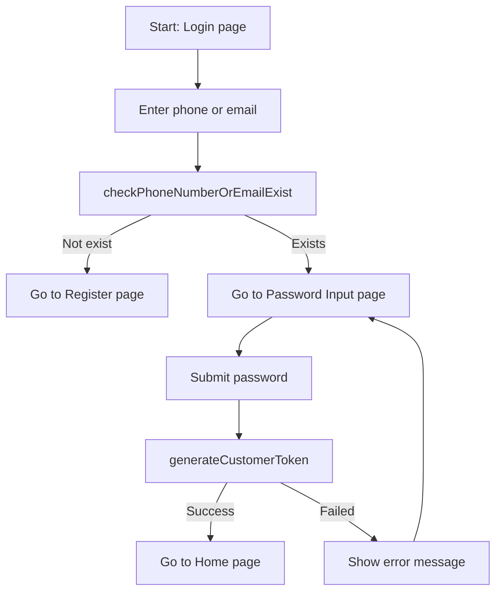

# Feature: Login

## Purpose
- Allow users to log in with phone number or email.

## Basic Flow
1. User enters `phoneNumberOrEmail`.
2. System calls `checkPhoneNumberOrEmailExist`.
3. If account does not exist, navigate user to the Register page.
4. If account exists, navigate user to the Password Input page.
5. User submits password, then system calls `generateCustomerToken`.
6. If token generation succeeds, navigate user to the Home page.
7. If token generation fails, show an error message and keep user on login/password flow.

## Flow Diagram

## Notes
- This is the baseline login flow and can be extended later with OTP/2FA or lockout rules.
